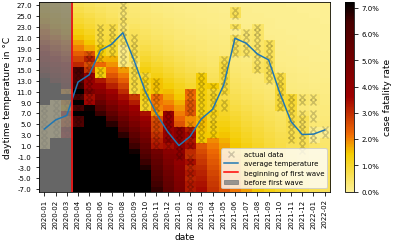

# Predicting Case Fatality Rate for COVID-19 by air temperature

This repository contains the python files, that have been used to predict COVID-19 case fatality rate from outside air temperature. The explanation is located in `doc/paper.pdf`. 

One plot that did not make it into the text, due to the page limit: 

Heatmap of case fatality rate. x- and y-axis denote date and temperature respectively. The color of each square denotes the average case fatality rate under these circumstances. The actual attained values are plotted on top and marked with a faint cross. Everything that is not marked with a cross is an estimate by the model. The goal here is to be able to 'hide' the actual data well in the prediction, which is achieved reasonably well.